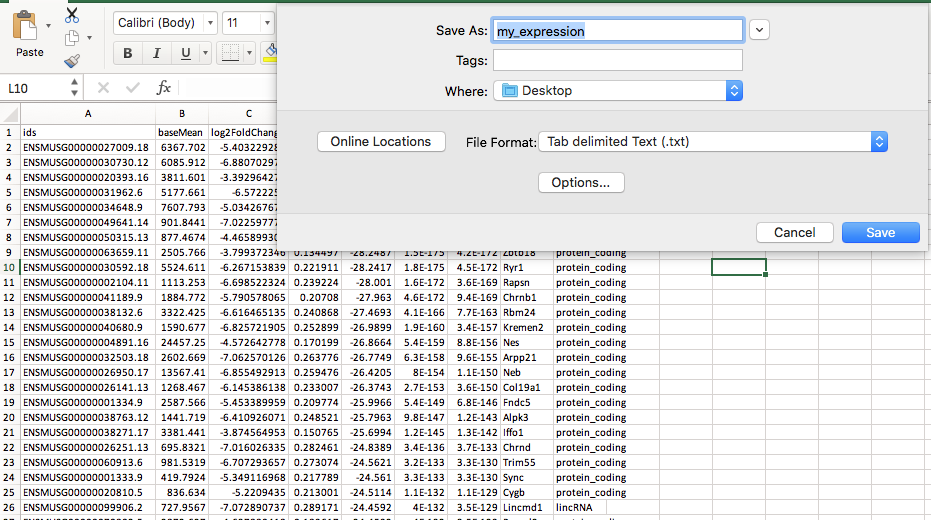

<h2>Module 2</h2>

<h3>The plan</h3>

* [Tabular files](#module2_tab)
* [GTF files](https://biocorecrg.github.io/advanced_linux_2019/gtf_format)
* [Space in volumes and permissions](https://biocorecrg.github.io/advanced_linux_2019/space_perm)
* [Variables and "For" Loops](https://biocorecrg.github.io/advanced_linux_2019/var_for)

<a name="module2_tab"></a>
<h3>Tabular files</h3>

A general tabular file (or tab separated text) is a table which columnes are separated by the character **\t**. A easy way to obtain this format is exporting a spreadsheet (like the excel file) in TSV.



You can download that file here <a href="my_expression.txt.zip">Download File</a> or via command line:

```{bash}
wget https://biocorecrg.github.io/advanced_linux_2019/my_expression.txt.zip

unzip my_expression.txt.zip 

more my_expression.txt

ids	baseMean	log2FoldChange	lfcSE	stat	pvalue	padj	gene.name	gene.type
ENSMUSG00000027009.18	6367.702449	-5.403229286	0.164511219	-32.84413864	1.3811E-236	3.1294E-232	Itga4	protein_coding
ENSMUSG00000030730.12	6085.911781	-6.880702974	0.224575305	-30.63873367	3.7337E-206	4.2301E-202	Atp2a1	protein_coding
ENSMUSG00000020393.16	3811.600859	-3.392964274	0.113074912	-30.00634011	8.1118E-198	6.1268E-194	Kremen1	protein_coding
ENSMUSG00000031962.6	5177.660551	-6.5722255	0.224972968	-29.21340091	1.3105E-187	7.4238E-184	Cdh15	protein_coding
ENSMUSG00000034648.9	7607.79254	-5.034267672	0.17328645	-29.05170986	1.4641E-185	6.6352E-182	Lrrn1	protein_coding
ENSMUSG00000049641.14	901.8440812	-7.022597773	0.246253844	-28.51771841	7.0643E-179	2.6678E-175	Vgll2	protein_coding
ENSMUSG00000050315.13	877.4673602	-4.465899309	0.157998266	-28.26549573	9.1813E-176	2.972E-172	Synpo2	protein_coding
ENSMUSG00000063659.11	2505.765754	-3.799372346	0.134497081	-28.2487347	1.4752E-175	4.1783E-172	Zbtb18	protein_coding

```

<h4>Exercise</h4>
Based on on your knowledge can you tell how many genes has this table?

Let's try now to select the genes with a **log2FoldChange** that are up-regulated.

```{bash}
awk '{if ($3>=2) print $0}' my_expression.txt |head -n 5

ids	baseMean	log2FoldChange	lfcSE	stat	pvalue	padj	gene.name	gene.type
ENSMUSG00000041272.11	692.0809888	2.853351422	0.173751262	16.4220472	1.33003E-60	1.57786E-58	Tox	protein_coding
ENSMUSG00000051177.16	336.7060978	2.671611253	0.176307092	15.15316949	7.21991E-52	6.76016E-50	Plcb1	protein_coding
ENSMUSG00000063415.12	2250.241249	3.41532392	0.22558106	15.14011824	8.80552E-52	8.21088E-50	Cyp26b1	protein_coding
ENSMUSG00000106795.1	170.0185428	2.898178587	0.19589793	14.79432982	1.59364E-49	1.40507E-47	RP24-150D8.2	lincRNA
```

<h4>Exercise</h4>
Can you tell how many genes are up-regulated?

Now let's try to extract the up and down-regulated. I'm using shuf just to show you that both the up and down regulated are both there. We will use the characters **||** that means **OR**

```{bash}
[lcozzuto@ant-login5 home]$ awk '{if ($3>=2 || $3<=-2) print $0}' my_expression.txt |shuf | head -n 6 
ENSMUSG00000057777.4	2264.035736	2.81870418	0.30180407	9.339516784	9.67748E-21	2.38091E-19	Mab21l2	protein_coding
ENSMUSG00000028838.11	186.4738697	3.633200922	0.647669945	5.609648789	2.02738E-08	1.52771E-07	Extl1	protein_coding
ENSMUSG00000064115.13	383.3757202	2.471663969	0.264982674	9.327643683	1.08251E-20	2.6546E-19	Cadm2	protein_coding
ENSMUSG00000025278.9	13010.44773	2.314262167	0.306197486	7.55807045	4.09092E-14	5.91175E-13	Flnb	protein_coding
ENSMUSG00000029384.5	3.863476129	-2.243196229	0.684465108	-3.277298146	0.001048056	0.003710611	AC134827.3	protein_coding
ENSMUSG00000071392.6	37.23725709	-4.98355982	0.541679915	-9.200193106	3.57307E-20	8.4866E-19	Ect2l	protein_coding
```

Sometimes you want to add more filters to be more stringent. In that case you can use the charachters **&&** that indicates **AND**. In this case we ask for both **log2FoldChange** >= 2 and **padj** <= 0.0001

```{bash}
awk '{if ($3>=2 && $6<=0.0001) print $0}' my_expression.txt | head -n 3

ENSMUSG00000041272.11	692.0809888	2.853351422	0.173751262	16.4220472	1.33003E-60	1.57786E-58	Tox	protein_coding
ENSMUSG00000051177.16	336.7060978	2.671611253	0.176307092	15.15316949	7.21991E-52	6.76016E-50	Plcb1	protein_coding
ENSMUSG00000063415.12	2250.241249	3.41532392	0.22558106	15.14011824	8.80552E-52	8.21088E-50	Cyp26b1	protein_coding
```

As you can see this combination removes the header. If you want to have it back you can add another **IF** before the current one.

```{bash}
awk '{if ($1=="ids") {print $0} else if ($3>=2 && $6<=0.0001) print $0}' my_expression.txt | head -n 5

ids	baseMean	log2FoldChange	lfcSE	stat	pvalue	padj	gene.name	gene.type
ENSMUSG00000041272.11	692.0809888	2.853351422	0.173751262	16.4220472	1.33003E-60	1.57786E-58	Tox	protein_coding
ENSMUSG00000051177.16	336.7060978	2.671611253	0.176307092	15.15316949	7.21991E-52	6.76016E-50	Plcb1	protein_coding
ENSMUSG00000063415.12	2250.241249	3.41532392	0.22558106	15.14011824	8.80552E-52	8.21088E-50	Cyp26b1	protein_coding
ENSMUSG00000106795.1	170.0185428	2.898178587	0.19589793	14.79432982	1.59364E-49	1.40507E-47	RP24-150D8.2	lincRNA
```

You can redirect the output of **AWK** to one or more files. So in one row you can extract the genes up and down regulated and send them to two different files

```{bash}
awk '{if ($3>=2) print $0 > "up_reg.txt"; if ($3<=-2) print $0 > "down_reg.txt" }' my_expression.txt
```

Careful that in this way the up_reg.txt will contain the header and the down_reg.txt not. 


<h3>Next Session</h3>

[Gtf file format](https://biocorecrg.github.io/advanced_linux_2019/gtf_format)


