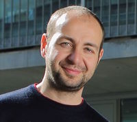
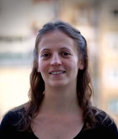

# Dates, time & location
Dates:
* **Module 1: Monday 19th 2019**
* **Module 2: Monday 21st 2019**

Time:
* 09:30-13:30 

Location:
Carrer del Dr. Aiguader, 88, 08003 Barcelona.
CRG Training center, PRBB building ground floor. 
<iframe src="https://www.google.com/maps/d/embed?mid=1ELysbd_HcyENvsuK5auBFbFpwZ0" width="640" height="480"></iframe>

## Instructors

|[Luca Cozzuto](mailto:luca.cozzuto@crg.eu)| [Julia Ponomarenko](mailto:julia.ponomarenko@crg.eu)  | [Sarah Bonnin](mailto:sarah.bonnin@crg.eu) |
| :---:  | :---:  | :---:  |
| | | | 

from the CRG [Bioinformatics core facility](https://biocore.crg.eu/) (office 460, 4th floor hotel side)

# Learning objectives
To be able to:
* Access genomics data from public repositories
* Know the existance of different data formats
* Be able to use the Linux commands to parse and convert those formats

# Program
* **Module one**
* **Module two**
