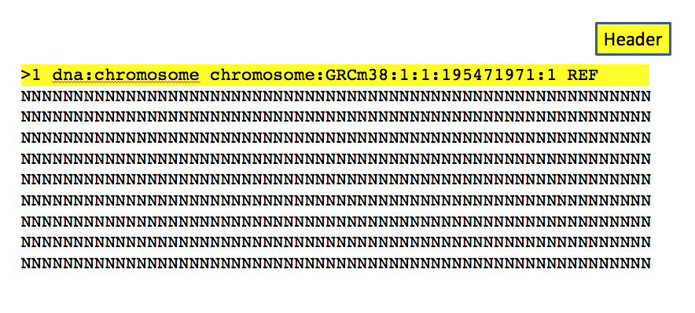
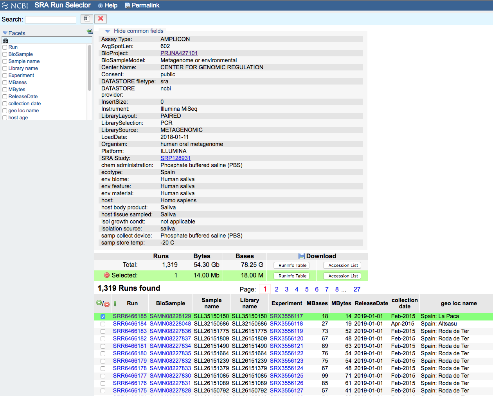

<a name="module1_bioformat"></a>
<h3>Sequence file formats: Fasta and fastq.</h3>

We already showed the fasta format. There is a header characterized by the presence of **>** and a number of rows containing the sequence.
The format is used for both nucleic acids and proteins.



Another way to store sequencing data, and particularly the short reads coming from the sequencers is the **Fastq** format.
This format allows to store also the information about the quality of that particular base, i.e. the probability that that base reading was true or not.


The format contains four rows for sequence with a header containing **@** as the first character, the sequence content, a **spacer** and the quality encoded using ASCII characters.


Currently most of the journals required the submissions of NGS data in a public repository for a pubblication. 

The major repositories are:
* [**SRA**](https://www.ncbi.nlm.nih.gov/sra) (Sequence Read Archive) from US
* [**ENA**](https://www.ebi.ac.uk/ena) (European Nucleotide Archive) 
* [**DDBJ-DRA**](https://www.ddbj.nig.ac.jp/dra/index-e.html) from Japan.

They are interconneted and mirror the data among them and are connected to other databases that contains also the results of a given analysis such as [**GEO**](https://www.ncbi.nlm.nih.gov/geo/) and [**Array-express**](https://www.ebi.ac.uk/arrayexpress/) that contain expression data.

As an example we can have a look at this paper about the [**characterization of the oral microbiome of young Spaniards**](https://www.ncbi.nlm.nih.gov/pubmed/30522523) (in which we were collaborators :) )


As you can see there is a section with **"Availability of data and materials"** with a link to the SRA accession number: [**PRJNA427101**](https://www.ncbi.nlm.nih.gov/bioproject/PRJNA427101). 


We can visit the webpage containing the information about every experiment submitted for that paper / project. This page is called **BioProject**


The page links to the whole list of sequencing runs (1319) 


We can send now the whole list to **Send results to Run selector**. 



Now we can select the samples of interest and download the meta-data or the accession list. The accession list is needed for the download using **fastq-dump** a program that is mandatory for this kind of database.

Let's try to download the first sample with the access **SRR6466185**. We need to indicate to the program that the data are from a paired end experiment, so they need to be written in separate files (option **--split-files**), and we want the to be compressed to avoid to waste disk space (option **--gzip**).

```{bash}
fastq-dump --gzip --split-files SRR6466185

Read 32345 spots for SRR6466185
Written 32345 spots for SRR6466185

ls -lh SRR*
-rw-r--r-- 1 lcozzuto Bioinformatics_Unit 6.4M Mar  8 12:01 SRR6466185_1.fastq.gz
-rw-r--r-- 1 lcozzuto Bioinformatics_Unit 7.5M Mar  8 12:01 SRR6466185_2.fastq.gz

```
We should have 32,345 reads. Let's try to count them using a combination of **zcat** that uncompress the file and writes the content to the terminal and **wc**. 

```{bash}
zcat SRR6466185_1.fastq.gz | wc -l
129380

zcat SRR6466185_2.fastq.gz | wc -l
129380
```
So considering that each sequence is defined by 4 rows we should have ```32,345*4=129,380```. We can also use **awk** for embedding also the division:

```{bash}
zcat SRR6466185_1.fastq.gz | wc -l | awk '{print $0/4}'
32345
```

<h3>Next Session</h3>

[Bed format and regular expressions](https://biocorecrg.github.io/advanced_linux_2019/regex)


