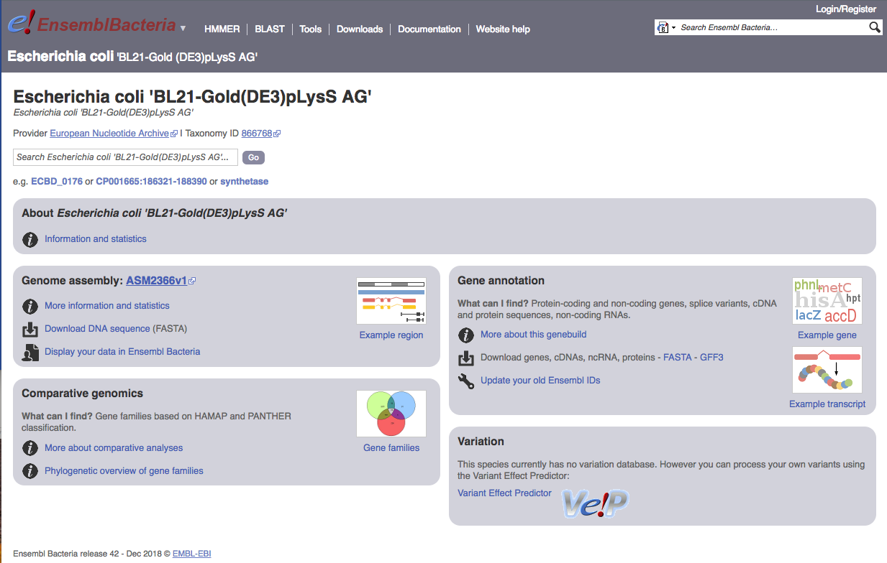
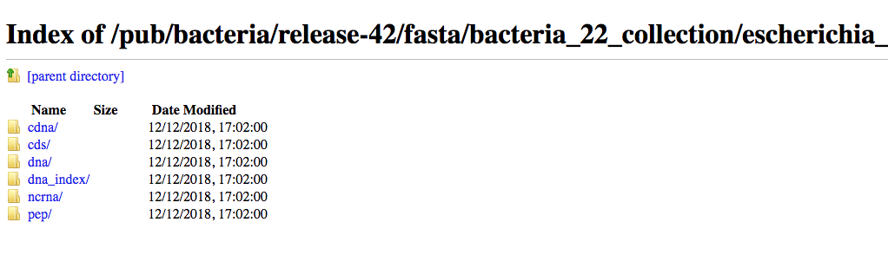
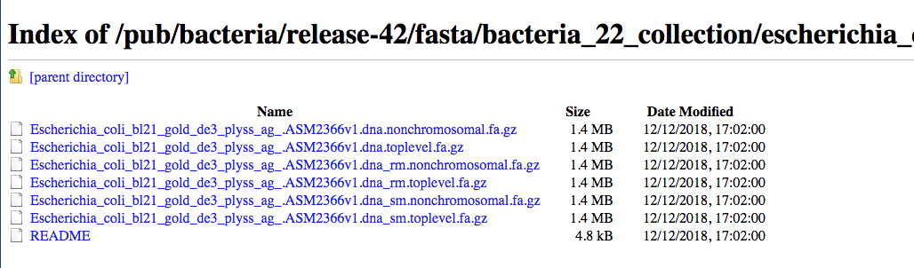
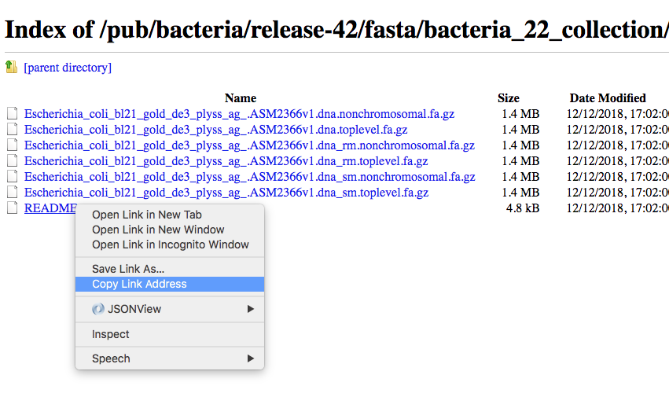

<a name="module1_down"></a>
<h3>Download files from repositories</h3>

Several institutions hosts differen kind of genomics data. For example the genome broswer [**Ensembl**](https://www.ensembl.org/index.html) is also a public repository of genomes and annotation that can be freely donloaded and used for any kind of analysis.
The resource [**Ensembl Bacteria**](https://bacteria.ensembl.org/index.html) contains a large number of bacterial genomes and their annotation. As an example we can browse the page corresponding to [*Escherichia coli 'BL21-Gold(DE3)pLysS AG'*](https://bacteria.ensembl.org/Escherichia_coli_bl21_gold_de3_plyss_ag_/Info/Index/)



We can click on "Download genes, cDNAs, ncRNA, proteins **FASTA**"



And then on **DNA**



Then as an example we can use the copy the link address of the **README** file using the mouse right button.



Then we can go back to our command line and use the program **wget** to download that file and using **CTRL+C** to pasthe the address

```{bash}
wget ftp://ftp.ensemblgenomes.org/pub/bacteria/release-42/fasta/bacteria_22_collection/escherichia_coli_bl21_gold_de3_plyss_ag_/dna/README


--2019-03-06 18:59:13--  ftp://ftp.ensemblgenomes.org/pub/bacteria/release-42/fasta/bacteria_22_collection/escherichia_coli_bl21_gold_de3_plyss_ag_/dna/README
           => ‘README’
Resolving ftp.ensemblgenomes.org (ftp.ensemblgenomes.org)... 193.62.197.94
Connecting to ftp.ensemblgenomes.org (ftp.ensemblgenomes.org)|193.62.197.94|:21... connected.
Logging in as anonymous ... Logged in!
==> SYST ... done.    ==> PWD ... done.
==> TYPE I ... done.  ==> CWD (1) /pub/bacteria/release-42/fasta/bacteria_22_collection/escherichia_coli_bl21_gold_de3_plyss_ag_/dna ... done.
==> SIZE README ... 4923
==> PASV ... done.    ==> RETR README ... done.
Length: 4923 (4.8K) (unauthoritative)

100%[======================================================================================================================>] 4,923       --.-K/s   in 0s      

2019-03-06 18:59:14 (295 MB/s) - ‘README’ saved [4923]
```

we can then use the program **more** to display part of the content of the file

```{bash}
more README


#### README ####

IMPORTANT: Please note you can download correlation data tables,
supported by Ensembl, via the highly customisable BioMart and
EnsMart data mining tools. See http://www.ensembl.org/biomart/martview or
http://www.ebi.ac.uk/biomart/ for more information.

The genome assembly represented here corresponds to  
GCA_000023665.1

#######################
Fasta DNA dumps
#######################

-----------
FILE NAMES
------------
The files are consistently named following this pattern:
   <species>.<assembly>.<sequence type>.<id type>.<id>.fa.gz

<species>:   The systematic name of the species.
<assembly>:  The assembly build name.
<sequence type>:
 * 'dna' - unmasked genomic DNA sequences.
--More--(14%)
```

After reading the README we can download the file named **toplevel** that contains chromsomes, regions not assembled into chromosomes and N padded haplotype/patch regions

```{bash}
wget ftp://ftp.ensemblgenomes.org/pub/bacteria/release-42/fasta/bacteria_22_collection/escherichia_coli_bl21_gold_de3_plyss_ag_/dna/Escherichia_coli_bl21_gold_de3_plyss_ag_.ASM2366v1.dna.toplevel.fa.gz
```

We can use the options "-lh" of the program **ls** to list attributes of the files and show in human readable format the size fo the files

```{bash}
ls -lh

total 2.0M
drwxr-xr-x 5 lcozzuto Bioinformatics_Unit  209 Mar  7 11:48 advanced_linux_2019
-rw-r--r-- 1 lcozzuto Bioinformatics_Unit 1.4M Mar  7 13:06 Escherichia_coli_bl21_gold_de3_plyss_ag_.ASM2366v1.dna.toplevel.fa.gz
drwxr-xr-x 2 lcozzuto Bioinformatics_Unit   39 Mar  6 18:17 my_beautiful_folder
-rw-r--r-- 1 lcozzuto Bioinformatics_Unit    0 Mar  6 18:15 my_ugly_file.txt
drwxr-xr-x 2 lcozzuto Bioinformatics_Unit   34 Mar  6 18:17 my_ugly_folder
-rw-r--r-- 1 lcozzuto Bioinformatics_Unit 4.9K Mar  6 18:59 README
```

For unzipping the file we can use the program **gunzip**. The uncompressed file is now **4.5M**. 

<h3>Next Session</h3>

[Manipulate files, piping, parsing, reformatting](https://biocorecrg.github.io/advanced_linux_2019/parsing)

