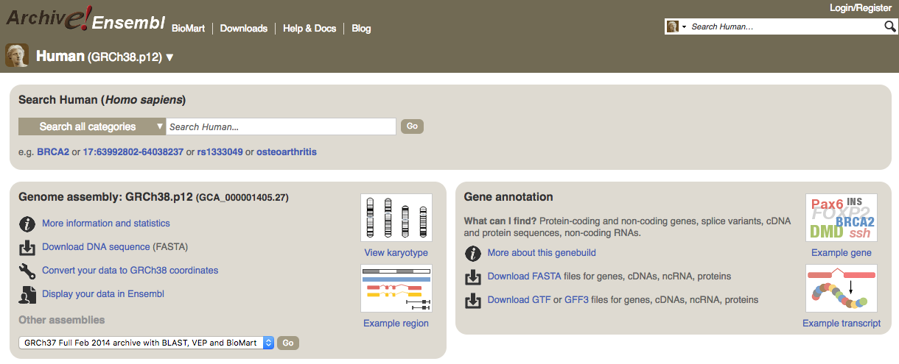

<a name="module2_gtf"></a>
<h3>GTF files</h3>

The **G**eneral **T**ransfer **F**ormat (GTF) format contains annotation of features and consists of one line per feature, each containing 9 columns of data.

GTF files can be downloaded for example from ENSEMBL, where each correspond to a specific version/update of the annotation.

The annotation from the latest version of the annotation is in the [ENSEMBL main page](http://www.ensembl.org/Homo_sapiens/Info/Index) (for *Homo sapiens*).

Previous versions of the annotation are found in the [archives](https://www.ensembl.org/info/website/archives/index.html).

* Download the GTF file in [ENSEMBL release 94](http://oct2018.archive.ensembl.org/Homo_sapiens/Info/Index) for *Homo sapiens*.




The name of the ENSEMBL gtf file is composed of:
* \<species\>: The systematic name of the species. (here, Homo_sapiens)
* \<assembly\>: The assembly build name. (here, GRCh38)
* \<version\>: The version of Ensembl from which the data was exported. (here, 94)


We can use this time the tool **curl** and the option **-o** for indicating the output file name.

```{bash}
curl -o Homo_sapiens.GRCh38.94.chr.gtf.gz ftp://ftp.ensembl.org/pub/release-94/gtf/homo_sapiens/Homo_sapiens.GRCh38.94.chr.gtf.gz

  % Total    % Received % Xferd  Average Speed   Time    Time     Time  Current
                                 Dload  Upload   Total   Spent    Left  Speed
100 41.6M  100 41.6M    0     0  19.6M      0  0:00:02  0:00:02 --:--:-- 19.6M
```

* Let's check the file:

```{bash}
zcat Homo_sapiens.GRCh38.94.chr.gtf.gz | head

#!genome-build GRCh38.p12
#!genome-version GRCh38
#!genome-date 2013-12
#!genome-build-accession NCBI:GCA_000001405.27
#!genebuild-last-updated 2018-07
1	havana	gene	11869	14409	.	+	.	gene_id "ENSG00000223972"; gene_version "5"; gene_name "DDX11L1"; gene_source "havana"; gene_biotype "transcribed_unprocessed_pseudogene";
1	havana	transcript	11869	14409	.	+	.	gene_id "ENSG00000223972"; gene_version "5"; transcript_id "ENST00000456328"; transcript_version "2"; gene_name "DDX11L1"; gene_source "havana"; gene_biotype "transcribed_unprocessed_pseudogene"; transcript_name "DDX11L1-202"; transcript_source "havana"; transcript_biotype "processed_transcript"; tag "basic"; transcript_support_level "1";
1	havana	exon	11869	12227	.	+	.	gene_id "ENSG00000223972"; gene_version "5"; transcript_id "ENST00000456328"; transcript_version "2"; exon_number "1"; gene_name "DDX11L1"; gene_source "havana"; gene_biotype "transcribed_unprocessed_pseudogene"; transcript_name "DDX11L1-202"; transcript_source "havana"; transcript_biotype "processed_transcript"; exon_id "ENSE00002234944"; exon_version "1"; tag "basic"; transcript_support_level "1";
1	havana	exon	12613	12721	.	+	.	gene_id "ENSG00000223972"; gene_version "5"; transcript_id "ENST00000456328"; transcript_version "2"; exon_number "2"; gene_name "DDX11L1"; gene_source "havana"; gene_biotype "transcribed_unprocessed_pseudogene"; transcript_name "DDX11L1-202"; transcript_source "havana"; transcript_biotype "processed_transcript"; exon_id "ENSE00003582793"; exon_version "1"; tag "basic"; transcript_support_level "1";
1	havana	exon	13221	14409	.	+	.	gene_id "ENSG00000223972"; gene_version "5"; transcript_id "ENST00000456328"; transcript_version "2"; exon_number "3"; gene_name "DDX11L1"; gene_source "havana"; gene_biotype "transcribed_unprocessed_pseudogene"; transcript_name "DDX11L1-202"; transcript_source "havana"; transcript_biotype "processed_transcript"; exon_id "ENSE00002312635"; exon_version "1"; tag "basic"; transcript_support_level "1";
```

The file is quite big. In general it has a header indicated by the first character **"#"** and one row per feature composed by 9 columns:

| Column number | Column name | Details |
| :----: | :----: | :----: |
| 1 | seqname | name of the chromosome or scaffold; chromosome names can be given with or without the 'chr' prefix. |
| 2 | source | name of the program that generated this feature, or the data source (database or project name) |
| 3 | feature | feature type name, e.g. Gene, Variation, Similarity |
| 4 | start | Start position of the feature, with sequence numbering starting at 1. |
| 5 | end | End position of the feature, with sequence numbering starting at 1. |
| 6 | score | A floating point value. |
| 7 | strand | defined as + (forward) or - (reverse). |
| 8 | frame | One of '0', '1' or '2'. '0' indicates that the first base of the feature is the first base of a codon, '1' that the second base is the first base of a codon, and so on.. |
| 9 | attribute | A semicolon-separated list of tag-value pairs, providing additional information about each feature. |

Let's count the number of gene features we have.

```{bash}
zcat Homo_sapiens.GRCh38.94.chr.gtf.gz | awk '{if ($3=="gene") print }'| wc -l 

58676
```

<h4>Exercise</h4>
Try to calculate the total number of each features. The result should be the following:

```{bash}
 746300 CDS
1261907 exon
 149893 five_prime_utr
  58676 gene
    120 Selenocysteine
  86423 start_codon
  78536 stop_codon
 148456 three_prime_utr
 206534 transcript
```

Now let's focus on genes. We see in the description the following annotations: gene_id, gene_version, gene_name, gene_source and gene_biotype.

```{bash}
zcat Homo_sapiens.GRCh38.94.chr.gtf.gz| awk '{if ($3=="gene") print}'| head -n 5

1	havana	gene	11869	14409	.	+	.	gene_id "ENSG00000223972"; gene_version "5"; gene_name "DDX11L1"; gene_source "havana"; gene_biotype "transcribed_unprocessed_pseudogene";
1	havana	gene	14404	29570	.	-	.	gene_id "ENSG00000227232"; gene_version "5"; gene_name "WASH7P"; gene_source "havana"; gene_biotype "unprocessed_pseudogene";
1	mirbase	gene	17369	17436	.	-	.	gene_id "ENSG00000278267"; gene_version "1"; gene_name "MIR6859-1"; gene_source "mirbase"; gene_biotype "miRNA";
1	havana	gene	29554	31109	.	+	.	gene_id "ENSG00000243485"; gene_version "5"; gene_name "MIR1302-2HG"; gene_source "havana"; gene_biotype "lincRNA";
1	mirbase	gene	30366	30503	.	+	.	gene_id "ENSG00000284332"; gene_version "1"; gene_name "MIR1302-2"; gene_source "mirbase"; gene_biotype "miRNA";
```
 We can extract the 10th field of gene features by using **awk** but specifying this time the separator (tab). This to avoid to consider also space as possible separators.
 
```{bash}
zcat Homo_sapiens.GRCh38.94.chr.gtf.gz| awk -F"\t" '{if ($3=="gene") print $9}'|head -n 5

gene_id "ENSG00000223972"; gene_version "5"; gene_name "DDX11L1"; gene_source "havana"; gene_biotype "transcribed_unprocessed_pseudogene";
gene_id "ENSG00000227232"; gene_version "5"; gene_name "WASH7P"; gene_source "havana"; gene_biotype "unprocessed_pseudogene";
gene_id "ENSG00000278267"; gene_version "1"; gene_name "MIR6859-1"; gene_source "mirbase"; gene_biotype "miRNA";
gene_id "ENSG00000243485"; gene_version "5"; gene_name "MIR1302-2HG"; gene_source "havana"; gene_biotype "lincRNA";
gene_id "ENSG00000284332"; gene_version "1"; gene_name "MIR1302-2"; gene_source "mirbase"; gene_biotype "miRNA";
```

We can then use either awk or sed to extract only the portion of text we are interested in 

```{bash}
zcat Homo_sapiens.GRCh38.94.chr.gtf.gz| awk -F"\t" '{if ($3=="gene") print $9}'| cut -d ";" -f 5 | cut -d " " -f 3 | head -n 5

"transcribed_unprocessed_pseudogene"
"unprocessed_pseudogene"
"miRNA"
"lincRNA"
"miRNA"
```

Now simply adding **sort** and **uniq -c** will allow us to get the statistics on biotypes.

```{bash}
zcat Homo_sapiens.GRCh38.94.chr.gtf.gz| awk -F"\t" '{if ($3=="gene") print $9}'| cut -d ";" -f 5 | cut -d " " -f 3 |sort|uniq -c 
     32 "3prime_overlapping_ncRNA"
   5583 "antisense"
     73 "bidirectional_promoter_lncRNA"
     14 "IG_C_gene"
      9 "IG_C_pseudogene"
     37 "IG_D_gene"
     18 "IG_J_gene"
      3 "IG_J_pseudogene"
      1 "IG_pseudogene"
    144 "IG_V_gene"
    188 "IG_V_pseudogene"
   7629 "lincRNA"
      1 "macro_lncRNA"
   1879 "miRNA"
   2212 "misc_RNA"
      2 "Mt_rRNA"
     22 "Mt_tRNA"
      2 "non_coding"
     41 "polymorphic_pseudogene"
  10189 "processed_pseudogene"
    600 "processed_transcript"
  19922 "protein_coding"
     18 "pseudogene"
      8 "ribozyme"
     52 "rRNA"
    499 "rRNA_pseudogene"
     49 "scaRNA"
      1 "scRNA"
    894 "sense_intronic"
    180 "sense_overlapping"
    943 "snoRNA"
   1900 "snRNA"
      5 "sRNA"
   1060 "TEC"
    481 "transcribed_processed_pseudogene"
    124 "transcribed_unitary_pseudogene"
    884 "transcribed_unprocessed_pseudogene"
      2 "translated_processed_pseudogene"
      6 "TR_C_gene"
      4 "TR_D_gene"
     79 "TR_J_gene"
      4 "TR_J_pseudogene"
    106 "TR_V_gene"
     33 "TR_V_pseudogene"
     95 "unitary_pseudogene"
   2647 "unprocessed_pseudogene"
      1 "vaultRNA"
```
There are some characters in linux that are considered "special" such as dot, slash, backslash, quotes etc... because are interpreted as patterns. For avoiding this extra intepretation you need to **escape** them using backslash **(\)**.

So you can add to the previous example the code ```sed s/\"//g``` to remove the quotation marks too.

<h4>Exercise</h4>
* Let's try to calculate the number of protein coding genes per chromosome. The results should be:

```
   2043 1
   1245 2
   1076 3
    752 4
    884 5
   1044 6
    910 7
    845 X
    683 8
    776 9
   1309 11
    729 10
   1036 12
    321 13
    613 14
    600 15
    855 16
   1186 17
    269 18
    543 20
   1472 19
     45 Y
    442 22
    231 21
     13 MT
```

* Let's try to calculate the number of exons per gene and to report also the gene name. We should redirect the result to a file since the numer of genes is about 60.000. The result should be:

```
      9 "ENSG00000223972"; "DDX11L1";
     11 "ENSG00000227232"; "WASH7P";
      1 "ENSG00000278267"; "MIR6859-1";
      5 "ENSG00000243485"; "MIR1302-2HG";
      1 "ENSG00000284332"; "MIR1302-2";
      5 "ENSG00000237613"; "FAM138A";
      1 "ENSG00000268020"; "OR4G4P";
      4 "ENSG00000240361"; "OR4G11P";
      4 "ENSG00000186092"; "OR4F5";
     17 "ENSG00000238009"; "AL627309.1";
...
```

* Create a BED file out of the genes from the GTF. **TIPS** awk allows you to change the column order! 
**Solution**

```{bash}
zcat Homo_sapiens.GRCh38.94.chr.gtf.gz | awk '$3=="gene" {OFS="\t"; print $1,$4,$5,".",$10,$7}' | sed s/\"//g|sed s/\;//g|head

1	11869	14409	.	ENSG00000223972	+
1	14404	29570	.	ENSG00000227232	-
1	17369	17436	.	ENSG00000278267	-
1	29554	31109	.	ENSG00000243485	+
1	30366	30503	.	ENSG00000284332	+
1	34554	36081	.	ENSG00000237613	-
1	52473	53312	.	ENSG00000268020	+
1	57598	64116	.	ENSG00000240361	+
1	65419	71585	.	ENSG00000186092	+
1	89295	133723	.	ENSG00000238009	-
```


<h3>Next Session</h3>

* [Space in volumes and permissions](https://biocorecrg.github.io/advanced_linux_2019/space_perm)

