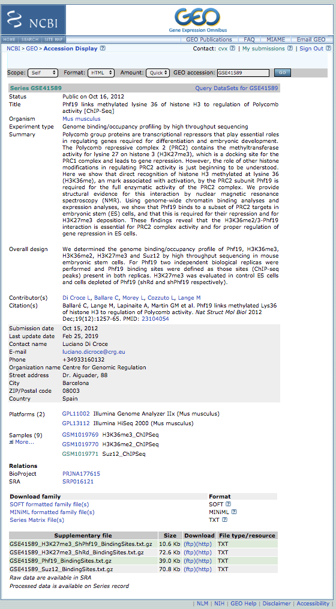

<a name="module1_bioformat"></a>
<h3>Bed format and regular expressions</h3>

The BED format is a "tab" separated text file. It consists of one line per feature, each containing 3-12 columns of data.
It is used for indicating genomic locations as the one of exons, binding sites, regulatory elements, etc.

Typical 6-fields bed format

|chrom|chromStart|chromEnd|name|score|strand|
|:---:|:---:|:---:|:---:|:---:|:---:|
|chr7|127471196|127472363|Pos1|0|+|
|chr7|127472363|127473530|Pos2|0|+|
|chr7|127473530|127474697|Pos3|0|+|
|chr7|127474697|127475864|Pos4|0|+|

Additionally you may have up to 6 more fields:

|thickStart|thickStart|itemRgb|blockCount|blockSizes|blockStarts|
|:---:|:---:|:---:|:---:|:---:|:---:|
|127471196|127472363|255,0,0|0|0|0|
|127472363|127473530|255,0,0|0|0|0|
|127473530|127474697|255,0,0|0|0|0|
|127474697|127475864|255,0,0|0|0|0|


This kind of file can be fed to a genome browser like [**UCSC genome browser**](https://genome-euro.ucsc.edu/cgi-bin/hgGateway?redirect=manual&source=genome.ucsc.edu) to highlight the genomic positions. Here an example about our coordinates:

<h4> Genome browser </h4>


BED files can be uploaded to public databases like **GEO** and **ArrayExpress**. As an example let's download the putative binding site positions obtained by a ChIP-seq experiment on Suz12 transcription factor [**GSE41589**](https://www.ncbi.nlm.nih.gov/geo/query/acc.cgi?acc=GSE41589). 



Let's use the right-click on FTP link to copy the link and **wget** to download the file.

```{bash}
wget ftp://ftp.ncbi.nlm.nih.gov/geo/series/GSE41nnn/GSE41589/suppl/GSE41589_Suz12_BindingSites.txt.gz

--2019-03-08 15:03:40--  ftp://ftp.ncbi.nlm.nih.gov/geo/series/GSE41nnn/GSE41589/suppl/GSE41589_Suz12_BindingSites.txt.gz
           => ‘GSE41589_Suz12_BindingSites.txt.gz’
Resolving ftp.ncbi.nlm.nih.gov (ftp.ncbi.nlm.nih.gov)... 130.14.250.12, 2607:f220:41e:250::11
Connecting to ftp.ncbi.nlm.nih.gov (ftp.ncbi.nlm.nih.gov)|130.14.250.12|:21... connected.
Logging in as anonymous ... Logged in!
==> SYST ... done.    ==> PWD ... done.
==> TYPE I ... done.  ==> CWD (1) /geo/series/GSE41nnn/GSE41589/suppl ... done.
==> SIZE GSE41589_Suz12_BindingSites.txt.gz ... 72526
==> PASV ... done.    ==> RETR GSE41589_Suz12_BindingSites.txt.gz ... done.
Length: 72526 (71K) (unauthoritative)

100%[======================================================================================================================>] 72,526       258KB/s   in 0.3s   

2019-03-08 15:03:42 (258 KB/s) - ‘GSE41589_Suz12_BindingSites.txt.gz’ saved [72526]
```

Since we have one row per feature, just counting the number of rows will give us the number of binding sites:

```{bash}
zcat GSE41589_Suz12_BindingSites.txt.gz | wc -l

8053
```

While extracting the first column with **cut** and piping the result to **uniq** will give us the list of chromosomes in which there is at lease one binding site

```{bash}
zcat GSE41589_Suz12_BindingSites.txt.gz | cut -f 1 | uniq 
chr1
chr10
chr11
chr12
chr13
chr14
chr15
chr16
chr17
chr18
chr19
chr2
chr3
chr4
chr5
chr6
chr7
chr8
chr9
chrX
chrY
```

We should not use **uniq** alone if we are not sure the values are not sorted... As an example if we shuffle the chromosome order **uniq** won't work as expected

```{bash}
zcat GSE41589_Suz12_BindingSites.txt.gz | cut -f 1 | uniq | wc -l 
21

zcat GSE41589_Suz12_BindingSites.txt.gz | cut -f 1 | shuf | uniq | wc -l 
7633
```

We can fix this using another tool named **sort**

```{bash}
zcat GSE41589_Suz12_BindingSites.txt.gz | cut -f 1 | shuf | sort | uniq | wc -l 
21
```

The tool **uniq** has an interesting parameter called **-c** that gives us the number of times that row was found. In this way we have the number of binding site per chromosome.

```{bash}
zcat GSE41589_Suz12_BindingSites.txt.gz | cut -f 1 | shuf | sort | uniq -c 
    525 chr1
    362 chr10
    603 chr11
    367 chr12
    392 chr13
    314 chr14
    351 chr15
    193 chr16
    303 chr17
    295 chr18
    232 chr19
    672 chr2
    397 chr3
    547 chr4
    511 chr5
    445 chr6
    480 chr7
    381 chr8
    435 chr9
    244 chrX
      5 chrY
```

Now let's try to extract the binding sites from the **chromosome 1**. We can use **grep** but we will extract also unwanted things...

```{bash}
zcat GSE41589_Suz12_BindingSites.txt.gz| grep chr1| cut -f 1| uniq
chr1
chr10
chr11
chr12
chr13
chr14
chr15
chr16
chr17
chr18
chr19
```

To avoid to extract also other chromosomes that simply start for chr1 we can use the option **-w**

```{bash}
zcat GSE41589_Suz12_BindingSites.txt.gz| grep -w chr1| cut -f 1| uniq
chr1
```

If you want more complex search we can use the **regular expression**: a sequence of characters that define a search pattern. 

Single characters bewteen square brackets can be searched at the same time

```{bash}
zcat GSE41589_Suz12_BindingSites.txt.gz| grep -w "chr[129]" | cut -f 1|uniq
chr1
chr2
chr9
```

For searching chromosomes with two digits you should use more intervals 

```{bash}
zcat GSE41589_Suz12_BindingSites.txt.gz| grep -w "chr[1][123]" | cut -f 1|uniq
chr11
chr12
chr13
```

Using a hiphen **-** allows to extract a whole interval from the first to the last number

```{bash}
zcat GSE41589_Suz12_BindingSites.txt.gz| grep -w "chr[1][0-9]" | cut -f 1|uniq
chr10
chr11
chr12
chr13
chr14
chr15
chr16
chr17
chr18
chr19
```

Another useful regular expression is **^** and **$** that indicates that the pattern has to be found at the beginning or the end of the string. Also **awk** is able to use regular expressions, this will make the search more accurate since you can decide which column to scan.

```{bash}
awk -F"\t" '{if ($2~"^MCELDI") print}' proteins.tab 

>ACT27842 pep supercontig:ASM2366v1:CP001665:800015:801223:-1 gene:ECBD_0774 transcript:ACT27842 gene_biotype:protein_coding transcript_biotype:protein_coding description:transposase IS4 family protein	MCELDILHDSLYQFCPELHLKRLNSLTLACHALLDCKTLTLTELGRNLPTKARTKHNIKRIDRLLGNRHLHKERLAVYRWHASFICSGNTMPIVLVDWSDIREQKRLMVLRASVALHGRSVTLYEKAFPLSEQCSKKAHDQFLADLASILPSNTTPLIVSDAGFKVPWYKSVEKLGWYWLSRVRGKVQYADLGAENWKPISNLHDMSSSHSKTLGYKRLTKSNPISCQILLYKSRSKGRKNQRSTRTHCHHPSPKIYSASAKEPWILATNLPVEIRTPKQLVNIYSKRMQIEETFRDLKSPAYGLGLRHSRTSSSERFDIMLLIALMLQLTCWLAGVHAQKQGWDKHFQANTVRNRNVLSTVRLGMEVLRHSGYTITREDSLVAATLLTQNLFTHGYVLGKL
>ACT27843 pep supercontig:ASM2366v1:CP001665:801353:802561:-1 gene:ECBD_0775 transcript:ACT27843 gene_biotype:protein_coding transcript_biotype:protein_coding description:transposase IS4 family protein	MCELDILHDSLYQFCPELHLKRLNSLTLACHALLDCKTLTLTELGRNLPTKARTKHNIKRIDRLLGNRHLHKERLAVYRWHASFICSGNTMPIVLVDWSDIREQKRLMVLRASVALHGRSVTLYEKAFPLSEQCSKKAHDQFLADLASILPSNTTPLIVSDAGFKVPWYKSVEKLGWYWLSRVRGKVQYADLGAENWKPISNLHDMSSSHSKTLGYKRLTKSNPISCQILLYKSRSKGRKNQRSTRTHCHHPSPKIYSASAKEPWVLATNLPVEIRTPKQLVNIYSKRMQIEETFRDLKSPAYGLGLRHSRTSSSERFDIMLLIALMLQLTCWLAGVHAQKQGWDKHFQANTVRNRNVLSTVRLGMEVLRHSGYTITREDLLVAATLLAQNLFTHGYALGKL
>ACT28724 pep supercontig:ASM2366v1:CP001665:1791810:1793018:-1 gene:ECBD_1670 transcript:ACT28724 gene_biotype:protein_coding transcript_biotype:protein_coding description:transposase IS4 family protein	MCELDILHDSLYQFCPELHLKRLNSLTLACHALLDCKTLTLTELGRNLPTKARTKHNIKRIDRLLGNRHLHKERLAVYRWHASFICSGNTMPIVLVDWSDIREQKRLMVLRASVALHGRSVTLYEKAFPLSEQCSKKAHDQFLADLASILPSNTTPLIVSDAGFKVPWYKSVEKLGWYWLSRVRGKVQYADLGAENWKPISNLHDMSSSHSKTLGYKRLTKSNPISCQILLYKSRSKGRKNQRSTRTHCHHPSPKIYSASAKEPWVLATNLPVEIRTPKQLVNIYSKRMQIEETFRDLKSPAYGLGLRHSRTSSSERFDIMLLIALMLQLTCWLAGVHAQKQGWDKHFQANTVRNRNVLSTVRLGMEVLRHSGYTITREDLLVAATLLAQNLFTHGYALGKL
>ACT28727 pep supercontig:ASM2366v1:CP001665:1795281:1796489:-1 gene:ECBD_1674 transcript:ACT28727 gene_biotype:protein_coding transcript_biotype:protein_coding description:transposase IS4 family protein	MCELDILHDSLYQFCPELHLKRLNSLTLACHALLDCKTLTLTELGRNLPTKARTKHNIKRIDRLLGNRHLHKERLAVYRWHASFICSGNTMPIVLVDWSDIREQKRLMVLRASVALHGRSVTLYEKAFPLSEQCSKKAHDQFLADLASILPSNTTPLIVSDAGFKVPWYKSVEKLGWYWLSRVRGKVQYADLGAENWKPISNLHDMSSSHSKTLGYKRLTKSNPISCQILLYKSRSKGRKNQRSTRTHCHHPSPKIYSASAKEPWILATNLPVEIRTPKQLVNIYSKRMQIEETFRDLKSPAYGLGLRHSRTSSSERFDIMLLIALMLQLTCWLAGVHAQKQGWDKHFQANTVRNRNVLSTVRLGMEVLRHSGYTITREDLLVAATLLAQNLFTHGYALGKL
>ACT30468 pep supercontig:ASM2366v1:CP001665:3610918:3612126:-1 gene:ECBD_3469 transcript:ACT30468 gene_biotype:protein_coding transcript_biotype:protein_coding description:transposase IS4 family protein	MCELDILHDSLYQFCPELHLKRLNSLTLACHALLDCKTLTLTELGRNLPTKARTKHNIKRIDRLLGNRHLHKERLAVYRWHASFICSGNTMPIVLVDWSDIREQKRLMVLRASVALHGRSVTLYEKAFPLSEQCSKKAHDQFLADLASILPSNTTPLIVSDAGFKVPWYKSVEKLGWYWLSRVRGKVQYADLGAENWKPISNLHDMSSSHSKTLGYKRLTKSNPISCQILLYKSRSKGRKNQRSTRTHCHHPSPKIYSASAKEPWILATNLPVEIRTPKQLVNIYSKRMQIEETFRDLKSPAYGLGLRHSRTSSSERFDIMLLIALMLQLTCWLAGVHAQKQGWDKHFQANTVRNRNVLSTVRLGMEVLRHSGYTITREDSLVAATLLTQNLFTHGYVLGKL
>ACT31152 pep supercontig:ASM2366v1:CP001665:4391870:4393078:-1 gene:ECBD_4170 transcript:ACT31152 gene_biotype:protein_coding transcript_biotype:protein_coding description:transposase IS4 family protein	MCELDILHDSLYQFCPELHLKRLNSLTLACHALLDCKTLTLTELGRNLPTKARTKHNIKRIDRLLGNRHLHKERLAVYRWHASFICSGNTMPIVLVDWSDIREQKRLMVLRASVALHGRSVTLYEKAFPLSEQCSKKAHDQFLADLASILPSNTTPLIVSDAGFKVPWYKSVEKLGWYWLSRVRGKVQYADLGAENWKPISNLHDMSSSHSKTLGYKRLTKSNPISCQILLYKSRSKGRKNQRSTRTHCHHPSPKIYSASAKEPWILATNLPVEIRTPKQLVNIYSKRMQIEETFRDLKSPAYGLGLRHSRTSSSERFDIMLLIALMLQLTCWLAGVHAQKQGWDKHFQANTVRNRNVLSTVRLGMEVLRHSGYTITREDLLVAATLLAQNLFTHGYALGKL


awk -F"\t" '{if ($2~"YFAKRLK$") print}' proteins.tab 

>ACT27943 pep supercontig:ASM2366v1:CP001665:911724:912023:-1 gene:ECBD_0875 transcript:ACT27943 gene_biotype:protein_coding transcript_biotype:protein_coding description:transposase IS3/IS911 family protein	MTKTVSTSKKPRKQHSPEFRSEALKLAERIGVTAAARELSLYESQLYNWRSKQQNQQTSSERELEMSTEIARLKRQLAERDEELAILQKAATYFAKRLK
>ACT29129 pep supercontig:ASM2366v1:CP001665:2195088:2195387:-1 gene:ECBD_2089 transcript:ACT29129 gene_biotype:protein_coding transcript_biotype:protein_coding description:transposase IS3/IS911 family protein	MTKTVSTSKKPRKQHSPEFRSEALKLAERIGVTAAARELSLYESQLYNWRSKQQNQQTSSERELEMSTEIARLKRQLAERDEELAILQKAATYFAKRLK
>ACT29266 pep supercontig:ASM2366v1:CP001665:2355429:2355728:-1 gene:ECBD_2236 transcript:ACT29266 gene_biotype:protein_coding transcript_biotype:protein_coding description:transposase IS3/IS911 family protein	MTKTVSTSKKPRKQHSPEFRSEALKLAERIGVTAAARELSLYESQLYNWRSKQQNQQTSSERELEMSTEIARLKRQLAERDEELAILQKAATYFAKRLK
>ACT29589 pep supercontig:ASM2366v1:CP001665:2682665:2682964:1 gene:ECBD_2567 transcript:ACT29589 gene_biotype:protein_coding transcript_biotype:protein_coding description:transposase IS3/IS911 family protein	MTKTVSTSKKPRKQHSPEFRSEALKLAERIGVTAAARELSLYESQLYNWRSKQQNQQTSSERELEMSTEIARLKRQLAERDEELAILQKAATYFAKRLK
```

Other useful pattern for the regular expression is the dot **.** that means any charachter.

```{bash}
grep -v ">" Escherichia_coli_bl21_gold_de3_plyss_ag_.ASM2366v1.pep.all.fa | grep "AAAAA.A"
```
MKLSRRSFMKANAV**AAAAAAA**GLSVPGVARAVVGQQEAIKWDKAPCRFCGTGCGVLVGTQ
EQQRRMEAERLAQMQQLSHQDDDS**AAAAALAA**QTGERKVGRNDPCPCGSGKKYKQCHGRL

```{bash}
grep -v ">" Escherichia_coli_bl21_gold_de3_plyss_ag_.ASM2366v1.pep.all.fa | grep "A[GA]AAA.AA"
```
GE**AGAAAPAA**KQEAAPAAAPAPAAGVKEVNVPDIGGDEVEVTEVMVKVGDKVAAEQSLIT
EQQRRMEAERLAQMQQLSHQDDDS**AAAAALAA**QTGERKVGRNDPCPCGSGKKYKQCHGRL

More extended regular expression can be searched by using grep with the parameter **-E**. For instance we can search for repetition:

```{bash}
grep -v ">" Escherichia_coli_bl21_gold_de3_plyss_ag_.ASM2366v1.pep.all.fa | grep -E "(AT){3}"
```
GVGIGIETVDGVPVKINNNSGATFVLSDGSNTLLFNTWVQAKSGRDVTLGNFT**ATATAT**F


<h3>Recap</h3>

* **uniq** it removes the duplicated elements in a list
* **sort** it sorts a given list
* **shuf** it shuffles a given list

## Exercises

* We see that some of the protein sequences are repeated in **proteins.tab** file. So different genes produce the same protein. How many unique proteins do we have in our proteins.tab file?

* How many sequences in SRR6466185_1.fastq.gz contain the pattern "GGGATGACGGC"? And how many in SRR6466185_2.fastq.gz? 

* Can you calculate the sum of the size of the first 10 sequences in **proteins.tab**? 

* Can you tell how many different kind of description there are in **seq_names.txt**?

* In Ensembl the chromosomes are named differently than in UCSC (1,2,3... vs chr1, chr2, chr3). Can you convert the binding sites stored within **GSE41589_Suz12_BindingSites.txt.gz** in a way that is compatible with Ensembl? 

<h3>Next Session</h3>

[Module 2](https://biocorecrg.github.io/advanced_linux_2019/Module2)

