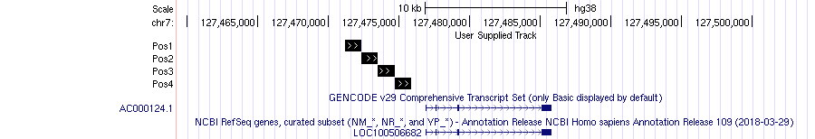

<h3>Bed format and regular expressions</h3>

The BED format is a "tab" separated text file. It consists of one line per feature, each containing 3-12 columns of data.
It is used for indicating genomic locations as the one of exons, binding sites, regulatory elements, etc.

|chrom|chromStart|chromEnd|name|score|strand|thickStart|thickStart|itemRgb|blockCount|blockSizes|blockStarts|
|:---:|:---:|:---:|:---:|:---:|:---:|:---:|:---:|:---:|:---:|:---:|:---:|
|chr7|127471196|127472363|Pos1|0|+|127471196|127472363|255,0,0||||
|chr7|127472363|127473530|Pos2|0|+|127472363|127473530|255,0,0||||
|chr7|127473530|127474697|Pos3|0|+|127473530|127474697|255,0,0||||
|chr7|127474697|127475864|Pos4|0|+|127474697|127475864|255,0,0||||

